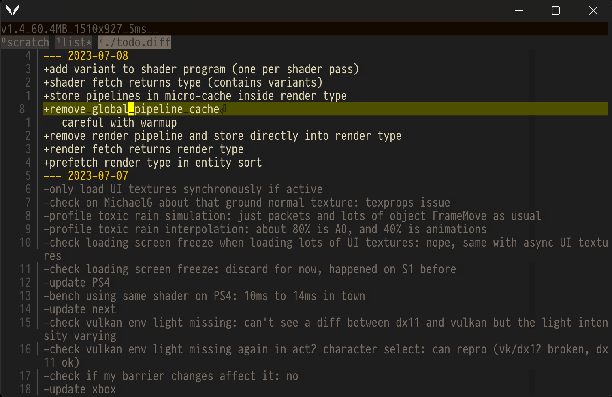

Vin - VI Normalized

My own attempt at a smaller vim:
- selected customised bindings (the ones that makes the most sense to me)
- sometimes simpler bindings (gg becomes g, since no other g commands supported)
- space-based action menu (replaces command mode altogether since much more limited)
- Windows-only (Unix line endings only though, CR displayed like any other character)
- no split support (only one buffer is displayed at a time)
- no config file (hard-coded with my preferred settings)
- no mouse support (who needs it)
